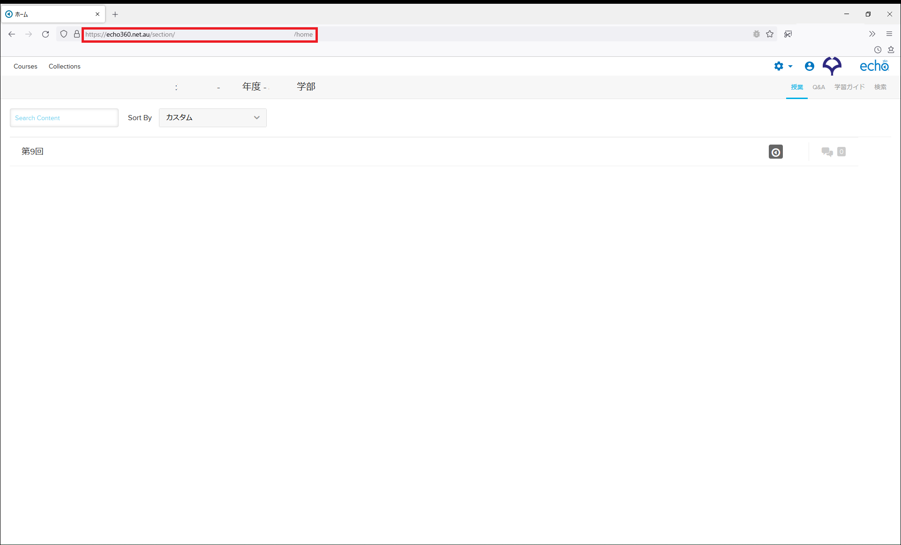

# EchoDownloader

このソフトはEcho360上に掲載された動画をダウンロードするためのソフトです。主に大阪大学の学生のために作成しましたが、他の大学等でもEcho360を使用されている大学であれば、使用できる場合もあるかと思います。

## 環境
- Windows10以上
- firefoxもしくはchrome/chromiumをインストール済み、もしくはMicrosoft edgeが有効

## 使用方法
1. ダウンロードしたzipファイルをすべて展開し、中にある「EchoDownloader.exe」を起動します。
1. 起動時、「ffmpegが実行できません。ダウンロードしますか？」と表示された場合は「はい」を押します。[ffmpeg](https://www.ffmpeg.org/)のwindows版を[gyan.dev](https://www.gyan.dev/ffmpeg/builds/)から自動でダウンロードします。
1. 「ffmpegのダウンロードが完了しました。」と表示されたら「OK」を押します。
1. EchoDownloaderが起動します。
1. コースURLにEcho360のコース画面のURL(下記の画像参照)を、ダウンロード先にダウンロード先のURLのパスを入力します。（ダウンロード先は「参照」ボタンも使用できます）

1. ダウンロードに使用するブラウザを指定します。(chromeの場合はchromiumを指定して下さい。)
1. 「開始」をクリックします。
1. ログイン画面が開いたらログインします。（ユーザー名はOUメールアドレス、パスワードはCLEと同一です。）
1. 完了した際、「ダウンロードが完了しました！」が表示されます。

## Thanks
- [ffmpeg](https://www.ffmpeg.org/)  
- [Echo360 Videos Downloader](https://github.com/soraxas/echo360)